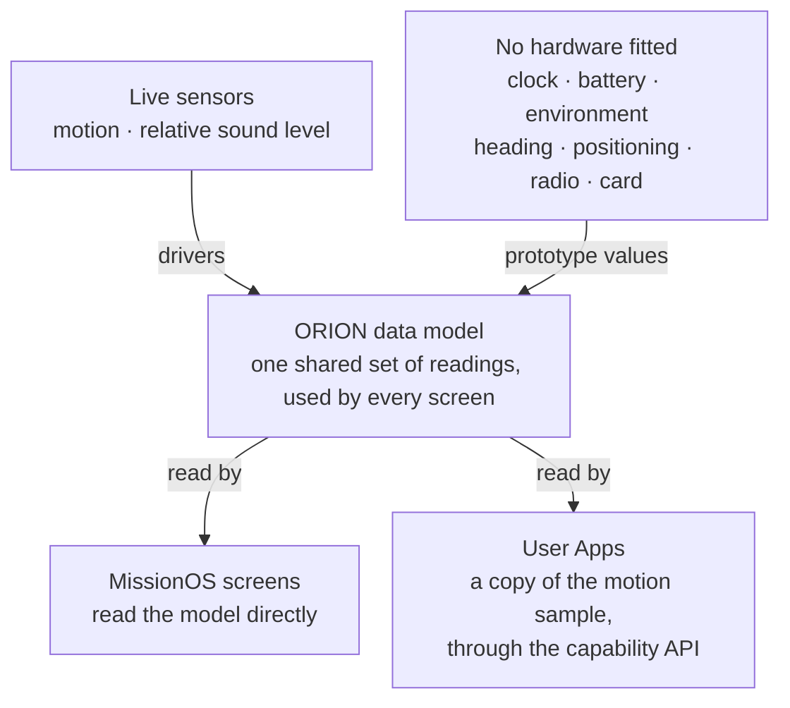

MissionOS keeps every reading in **one shared data model**. Drivers write into it; screens read from
it; no screen ever talks to a driver.

That single decision is why the interface could be built as a whole before the hardware was
finished. A screen is complete once it reads the right field, and wiring a sensor lights it up
everywhere it appears at once — with no change to a screen file. Where a sensor is not yet fitted,
the model holds a **prototype value**, so the screen still lays out, draws and can be tested.

The cost of that design is that you cannot tell from a screen alone whether a number was measured.
This page is the answer to that question.

Drivers write readings into one shared data model. Screens read from it. Where no driver exists,
the model holds prototype values, so the screen still lays out and draws.

<Warning>
  **Prototype values are not measurements.** A temperature, position or battery level on the
  development prototype is a fixed value unless this page lists that reading as live. Some trend
  lines are generated to look realistic. Do not use them as data.
</Warning>

## Readings on the development prototype

| Reading | On the prototype | Notes |
|---|---|---|
| Acceleration (x, y, z) | `[VERIFIED]` Live | From the prototype's motion sensor. |
| Tilt (pitch, roll) | `[VERIFIED]` Live | Derived from acceleration. |
| g-force and peak g | `[VERIFIED]` Live | Derived from acceleration. |
| Sound level | `[IMPLEMENTED]` Live | Relative and uncalibrated, from a microphone wired to the prototype. Maximum and average are running statistics. No frequency spectrum. |
| Ambient light | `[IMPLEMENTED]` Driver only | A driver exists, but no light sensor is detected on the prototype, so no reading is taken. |
| Compass heading | Prototype values | The prototype's motion sensor has no magnetometer. |
| Time and date | Prototype values | No clock driver. |
| Battery level and charging | Prototype values | No battery measurement. |
| Temperature, humidity, pressure | Prototype values | Needs environmental sensing, which the prototype does not have. |
| Air-quality index | Prototype values | Needs environmental sensing. A VOC-based index is planned; it is not a particulate or health measurement. |
| Pressure altitude and climb rate | Prototype values | Climb rate is calculated from the demo altitude, so it stays at zero. |
| Position, fix and satellites | Prototype values | No positioning hardware. |
| Long-range radio messages and frames | Prototype values | No radio module. |
| Wi-Fi networks, Bluetooth devices | Prototype values | The device software does not use the radios yet. |
| Storage card | Prototype values | No card slot on the prototype. |
| Interface state (toggles, logging session, missions) | On-device | Held in the model; not saved across restarts. |

<Note>
  The rule is simple: if a reading is not listed as **Live** above, it was set once at start-up and
  never changes. Nothing in the interface distinguishes the two, which is why this page exists.
</Note>

## What User Apps receive

User Apps never read the data model. Through the `motion` capability they receive a **copy** of the
latest acceleration and tilt sample, with a sequence number that advances when the reading changes.
No other reading is available to apps in ABI 1.0.

See [Capabilities → Motion](/user-apps/capabilities#motion).

## Related

<Columns cols={3}>
  <Card title="Screen catalogue" icon="table-list" href="/missionos/screens">
    The data source of every screen.
  </Card>
  <Card title="Development status" icon="list-check" href="/overview/status">
    Feature-by-feature status.
  </Card>
  <Card title="Hardware capabilities" icon="microchip" href="/reference/hardware">
    What the prototype can actually sense.
  </Card>
</Columns>
