A User App is a program you write for ORION without changing its firmware. You write it in C, compile it to WebAssembly, and install it while ORION runs. It appears in the launcher's **User Apps** tab.

<Note>
  **ORION User App Platform v1 — Functionally Complete**

  The runtime, capability API, package format, installer, registry, launcher integration, app storage and SDK Alpha are complete and validated on the development prototype. **The platform is not production-secure**: packages are unsigned, installation uses a USB developer connection, and there is no store or over-the-air distribution. See [Security](/user-apps/security).
</Note>

## What an app can do

An app declares the capabilities it needs, and can use nothing else.

| Capability | What it gives an app |
|---|---|
| `system` | Lifecycle, time, developer log, redraw requests |
| `display` | Clear, filled rectangles and one-line text on the 280 × 240 panel, in the ORION palette |
| `input` | Tap and swipe gestures |
| `motion` | A copy of the latest acceleration and tilt reading |
| `storage` | A small private key/value store that survives restarts |

An app cannot reach drivers, I²C, SPI or GPIO, the file system, MissionOS screens or data, other apps, or the network. See [Capabilities](/user-apps/capabilities).

## From package to running app

Every step between your source code and running code is checked — on your computer, and again on
the device.

```mermaid
---
config:
  flowchart:
    nodeSpacing: 24
    rankSpacing: 30
    subGraphTitleMargin:
      top: 10
      bottom: 10
---
flowchart TD
  subgraph dev["Your computer"]
    SRC["Source code"] -->|"orion build"| WASM["WebAssembly module"] --> PKG[".orionapp package"]
  end
  PKG -->|"orion install, over USB"| CHK["Package checks"]
  subgraph device["ORION"]
    CHK -->|accepted| VAL["Module validation"]
    VAL -->|accepted| INST["Installer"]
    INST -->|installed| REG["Registry and catalog"]
    REG --> LAUNCH["Launcher — User Apps tab"]
    LAUNCH -->|"tap to launch"| SUP["Supervisor"]
    SUP --> WAMR["WAMR runtime"]
    WAMR --> RUN["Running User App"]
    RUN -->|"host calls"| CAP["Capabilities"]
    CAP -->|returns| RUN
  end
```

| Stage | What happens |
|---|---|
| **Source code** | C against `<orion/orion.h>`, plus an `orion.json` manifest declaring capabilities and limits |
| **WebAssembly module** | `orion build` compiles and validates it |
| **`.orionapp` package** | Manifest, optional icon, the WebAssembly module and a SHA-256 digest, in one file |
| **Package checks** | Digest, structure, declared API and runtime, and limits — on the device |
| **Module validation** | Every import matches a declared capability, memory is within limits, and **no code runs at load** |
| **Installer** | The package is staged, then activated in a single step |
| **Registry and catalog** | Records what is installed, and supplies the launcher's tile list |
| **Launcher** | The app appears in the **User Apps** tab |
| **Supervisor** | Enforces the per-callback instruction limit and wall-clock budget |
| **WAMR runtime** | Executes the module in the WebAssembly fast interpreter |
| **Running User App** | Sees only its own memory. A fault stops the app, not ORION |
| **Capabilities** | The only route out — and only what the manifest declared |

A rejected package leaves the installed apps untouched: nothing is activated until every check has
passed.

## Learn

<Columns cols={2}>
  <Card title="Concepts" icon="lightbulb" href="/user-apps/concepts">
    The sandbox, budgets, memory and costs.
  </Card>
  <Card title="Quickstart" icon="rocket" href="/user-apps/quickstart">
    Build and install your first app.
  </Card>
  <Card title="Lifecycle" icon="arrows-rotate" href="/user-apps/lifecycle">
    The four callbacks and when they run.
  </Card>
  <Card title="Capabilities" icon="key" href="/user-apps/capabilities">
    Display, input, motion, storage and system.
  </Card>
  <Card title="Storage" icon="hard-drive" href="/user-apps/storage">
    Private key/value storage and its rules.
  </Card>
  <Card title="SDK" icon="toolbox" href="/user-apps/sdk">
    What is in the SDK and the orion command.
  </Card>
  <Card title="Packaging" icon="cube" href="/user-apps/packaging">
    orion.json, the build pipeline and .orionapp.
  </Card>
  <Card title="Examples" icon="code" href="/user-apps/examples">
    Hello ORION, Tap Counter and Motion.
  </Card>
  <Card title="Security" icon="shield" href="/user-apps/security">
    What the sandbox contains, and what it does not.
  </Card>
  <Card title="Troubleshooting" icon="wrench" href="/user-apps/troubleshooting">
    Build errors, rejected installs, stopped apps.
  </Card>
</Columns>
